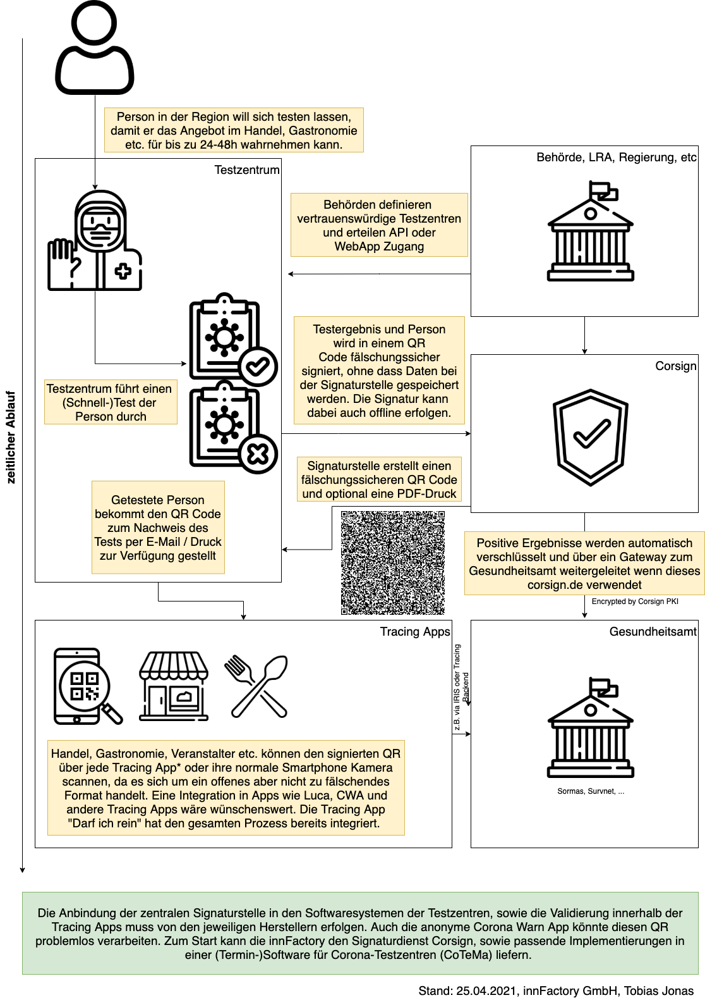

## Corona Signing Tokens (Corsign)

### What is Corsign?
Corona Signing or Corsign is a method of storing all Covid-19 relevant data inside of a signed QR-Code which can be used by any application. The signer in this case would not need to store any personal information inside the signing system.
Because of the open JWT format (RFC 7519), the result can be interpreted in ANY Covid-19 related app. The cryptographic methods behind the token signing process are all open source and battle proof. Offline validation is also possible because of the JWKs (RFC 7517) Remote Sources in our SaaS implementation. So every tracing app is able to read the QR Code take the needed information and check the signing offline (or online via API call).

I have written about this idea on LinkedIn. Don't hesitate to call or write about any thoughts or suggestions you might have for the model or implementation.

https://www.linkedin.com/pulse/konzept-einer-zentralen-signaturstelle-f%25C3%25BCr-das-freitesten-jonas/

Our own implementation of this PKI System (corsign.de) is described in headline "corsign.de". 

### The Corsign Token

Corsign extends the default JWT Claims with a field called pld (= "payload") containing a JSON structure with personally identifiable information, Covid19 relevant data, and optional third-party application data.
An example (from our dev issuer https://dev-iss.corsign.de):


```
eyJraWQiOiI1MzUzYTgzMS0yMmIzLTQwNmUtYWYzMy1jN2NiZjIyNmJjMGQiLCJhbGciOiJSUzUxMiJ9.eyJzdWIiOiI3YzEwOTA1ZC05ZWQ4LTQ2YWEtOTc3MS1lNzBiYWU1ODYzYjAiLCJhdWQiOiJUZXN0emVudHJ1bSBMb3JldHRvd2llc2UgW3Rlc3QuY29yb25hdGVzdC5iYXllcm5dIiwibmJmIjoxNjE5MzQwMDg2LCJpc3MiOiJodHRwczpcL1wvZGV2LWlzcy5jb3JzaWduLmRlIiwicGxkIjp7InBlcnNvbiI6eyJiaXJ0aGRheSI6IjE5OTItMDMtMDIiLCJ6aXAiOiI4MzAyMiIsImNvdW50cnkiOiJERSIsImZpcnN0bmFtZSI6Ik1heCIsInBob25lTnVtYmVyIjoiMDgwMzE1ODU4NTgiLCJjaXR5IjoiUm9zZW5oZWltIiwic2V4IjoiTSIsImlkQ2FyZE51bWJlciI6IkxGQzEyM0FCQyIsInN0cmVldDEiOiJCYWhuaG9mc3RyYcOfZSAxIiwiZW1haWwiOiJtZWluZUBtYWlsLmRlIiwibGFzdG5hbWUiOiJNdXN0ZXJtYW5uIn0sImluZm9ybWF0aW9uIjp7ImlzTmVnYXRpdmUiOnRydWUsInRlc3RUeXBlIjoiUENSIn19LCJleHAiOjE2MTk2ODU2ODYsImlhdCI6MTYxOTM0MDA4Nn0.cF8VqWI4wZft0X75iNUIL40jbGXAhpypi9KeT9l_nORmH_HAm569PIdFU-E3gTzLiVTrnQfTS1JGRytYL0y-4LbW8FRXrHkB3Af8VQeVKkhv3LkqUmOBgdY6zPwnwhwDAoBX2s4vVzoS0JEXnn_UPMnR_sqBNOeS96VAN6pf-vtBLM4l967XCaFYr7Qp84AIkM-YBeDmJbYFUcMcu3qQNu871Ixmdtiq1i2ImVHNhtUxTZrAzpUH4SI8JL4o7uIMGjRA5bgT67IV3CISoSlUFUyOgoHOMpcm6pDsfAylmvWqFfzh3gctkxwQzMHOyoStaDjAObBQ74UgCtS2CxsnGw
```

```jwt
{
  "sub": "7c10905d-9ed8-46aa-9771-e70bae5863b0",
  "aud": "Testzentrum Lorettowiese [test.coronatest.bayern]",
  "nbf": 1619340086,
  "iss": "https://dev-iss.corsign.de",
  "pld": {
    "person": {
      "birthday": "1992-03-02",
      "zip": "83022",
      "country": "DE",
      "firstname": "Max",
      "phoneNumber": "08031585858",
      "city": "Rosenheim",
      "sex": "M",
      "idCardNumber": "LFC123ABC",
      "street1": "Bahnhofstraße 1",
      "email": "meine@mail.de",
      "lastname": "Mustermann"
    },
    "information": {
      "isNegative": true,
      "testType": "PCR"
    }
  },
  "exp": 1619685686,
  "iat": 1619340086
}
```

The following list shows all possible fields, most of them are optional. Please [open a Github issue](https://github.com/innFactory/corsign-core/issues/new) if you think a field is missing or should be required. If you don't need the information just ignore the other fields.

```json
{
  "sub": "UUID (Unique User IDentifier) which could be used in third-party applications such as SORMAS, valid until a new test is performed",
  "exp": "The token expires after a pre-defined duration (e.g 24 hours) passed since the Sars-CoV-2 was done",
  "iat": "Date and time of the Sars-Cov-2 test",
  "nbf": "Valid not before Sars-Cov-2 test date and time",
  "aud": "Place for the signer, can be used to store additional information for a third-party application",
  "pld": {
    "person": {
      "idCardNumber": "LFC123ABC",
      "firstname": "Max *required",
      "lastname": "Mustermann *required",
      "sex": "F(emale)|M(ale)|D(ivers)",
      "birthdate": "LocalDate (yyyy-mm-dd)",
      "email": "meine@mail.de *required or phoneNumber", 
      "phoneNumber": "0803199999 *required or E-Mail",
      "street1": "Bahnhofstraße 1",
      "street2": "",
      "city": "Rosenheim",
      "zip": "zip code",
      "country": "2 letter Alpha-2 country code as defined in ISO 3166"
    },
    "information": {
      "isNegative": true,
      "testType": "Type of test used e.g. pcr|antigen|...",
      "testId": "Barcode of Covid19 Test",
      "isVaccinated": true,
      "vaccine": "Shortname of the administered vaccine like BNT162b2|mRNA-1273|...",
      "appData1": "Additional third-party app data as json",
      "appData2": "Additional third-party app data as json"
    }
  }
}
```

### QuickStart

1) Clone the repository (`git clone https://github.com/innFactory/corsign-core.git`)
2) Install Scala & sbt ([https://www.scala-sbt.org/1.x/docs/Setup.html](https://www.scala-sbt.org/1.x/docs/Setup.html))
3) Run `sbt coreTest` to test the core-features
4) Under core/src/main/scala/corsign/core/app/Standalone is a Standalone Console Application which can be executed with `sbt "project core; run"`. This produces a sample output like the following snippet:
```
Generating a new RSA key. 06f806e2-0e19-402d-a4a0-2aca1cc80f55
Public Key:
-----BEGIN PUBLIC KEY-----
MIIBIjANBgkqhkiG9w0BAQEFAAOCAQ8AMIIBCgKCAQEAr/3psBufe6VAAa0HyHX7
JgPtHxN+KhwUCnQ31UsdFu8kt2Y9Dn9Efw2ZF47rQdj0/fa3xal/rQVOufT3+L8Z
YwLOTsF7HemoqxCEpsPrhsxoBLKpNcq2gSSRnaWueRrqzqr15fT3S6ULpN5y8wLV
E869gGROzksS25sDOnOyiY34X3WqM+AYn7dqKkMnLfbhwLrHq2Q777akME5FSOOe
c/Re8j2n6fl2bDlynjxuI/HbnTrufOjabn7AqqiUpnNbQceQSgKs6bZ+Wv7PjHT0
9lYLYDpEJ80Nm7/alSNWtP3Ybg6Bjqt31p9R3/pH1hemDFlhUDE71lUisJDPZ+gg
XQIDAQAB
-----END PUBLIC KEY-----


Signed Token with this Key is:
Some(JWTToken(eyJraWQiOiIwNmY4MDZlMi0wZTE5LTQwMmQtYTRhMC0yYWNhMWNjODBmNTUiLCJhbGciOiJSUzUxMiJ9.eyJzdWIiOiI1MmQwN2NiZS1mZDNhLTQ4MDUtOTMyZS01YmNlNzVjZTZhMzkiLCJhdWQiOiJhdWRpZW5jZSIsIm5iZiI6MTYxNzIxODI2NSwiaXNzIjoiaXNzdWVyIiwicGxkIjp7InBlcnNvbiI6eyJiaXJ0aGRheSI6MTYxNzIxODI2NjAyMCwiemlwIjoiODMwMjIiLCJjb3VudHJ5IjoiR2VybWFueSIsImZpcnN0bmFtZSI6Ik1heCIsInBob25lTnVtYmVyIjoiMDgwMzE5OTk5OSIsImFkZHJlc3MiOiJCYWhuaG9mc3RyYcOfZSAxIiwiZ2VuZGVyIjoiTSIsImNpdHkiOiJSb3NlbmhlaW0iLCJpZENhcmROdW1iZXIiOiJMRkMxMjNBQkMiLCJlbWFpbCI6Im1laW5lQG1haWwuZGUiLCJsYXN0bmFtZSI6Ik11c3Rlcm1hbm4ifSwiaW5mb3JtYXRpb24iOnsiaXNOZWdhdGl2ZSI6dHJ1ZX19LCJleHAiOjE2MTcyMjU0NjUsImlhdCI6MTYxNzIxODI2NX0.GjCqG2ZtcrRb8dVrmrJD7b8YGEasNxLBTLT4bnM5QoOwIBB1kcKWHe6qr0Kw6NogihfCX4iAq3DQcVzJbbECvD0TQJXHb1vehb8TU7hrJta_J_Ovr7zh0BbVuZ39esPuCnaXrjiOYMWK8ZlJhVaWkgb46pfVJpWXqcaa6Vh93ZfyG-X1h-8Luwqf6AUcblICV-nVSdQ085vRr67OS0r6k2OB5vNFkLuifjD1sc32W_ofUfgHUy446Aerca0GDlhNMaRwBVx4LZJWAbXNTZmKNwLTJvRT4Cocgo4ldPWVCrwySgv__Q3ebPkjgZG36zTcOaBE5vXuwDPuNELboUI-Sg))

Parsed content from validated token is
JWTClaims(52d07cbe-fd3a-4805-932e-5bce75ce6a39,issuer,audience,1617225465,1617218265,1617218265,Payload(Person(Max,Mustermann,Some(M),Some(Wed Mar 31 21:17:46 CEST 2021),Some(0803199999),Some(meine@mail.de),Some(LFC123ABC),Some(Bahnhofstraße 1),Some(83022),Some(Rosenheim),Some(Germany)),CorData(Some(true),None,None)))
{"kty":"RSA","e":"AQAB","use":"sig","kid":"06f806e2-0e19-402d-a4a0-2aca1cc80f55","alg":"RS512","n":"r_3psBufe6VAAa0HyHX7JgPtHxN-KhwUCnQ31UsdFu8kt2Y9Dn9Efw2ZF47rQdj0_fa3xal_rQVOufT3-L8ZYwLOTsF7HemoqxCEpsPrhsxoBLKpNcq2gSSRnaWueRrqzqr15fT3S6ULpN5y8wLVE869gGROzksS25sDOnOyiY34X3WqM-AYn7dqKkMnLfbhwLrHq2Q777akME5FSOOec_Re8j2n6fl2bDlynjxuI_HbnTrufOjabn7AqqiUpnNbQceQSgKs6bZ-Wv7PjHT09lYLYDpEJ80Nm7_alSNWtP3Ybg6Bjqt31p9R3_pH1hemDFlhUDE71lUisJDPZ-ggXQ"}

Now try to sign with a Deserialized PEM Key

The second JWT Token is:
Some(JWTToken(eyJraWQiOiI3MWUwNzAzNS1jZWIxLTQ1N2QtODUyMS1kYzRiNTAzMmI1NzAiLCJhbGciOiJSUzUxMiJ9.eyJzdWIiOiI1MmQwN2NiZS1mZDNhLTQ4MDUtOTMyZS01YmNlNzVjZTZhMzkiLCJhdWQiOiJhdWRpZW5jZSIsIm5iZiI6MTYxNzIxODI2NSwiaXNzIjoiaXNzdWVyIiwicGxkIjp7InBlcnNvbiI6eyJiaXJ0aGRheSI6MTYxNzIxODI2NjAyMCwiemlwIjoiODMwMjIiLCJjb3VudHJ5IjoiR2VybWFueSIsImZpcnN0bmFtZSI6Ik1heCIsInBob25lTnVtYmVyIjoiMDgwMzE5OTk5OSIsImFkZHJlc3MiOiJCYWhuaG9mc3RyYcOfZSAxIiwiZ2VuZGVyIjoiTSIsImNpdHkiOiJSb3NlbmhlaW0iLCJpZENhcmROdW1iZXIiOiJMRkMxMjNBQkMiLCJlbWFpbCI6Im1laW5lQG1haWwuZGUiLCJsYXN0bmFtZSI6Ik11c3Rlcm1hbm4ifSwiaW5mb3JtYXRpb24iOnsiaXNOZWdhdGl2ZSI6dHJ1ZX19LCJleHAiOjE2MTcyMjU0NjUsImlhdCI6MTYxNzIxODI2NX0.my8hZOn_BmOaD2h1fG96HAJ-pbvNiMi5yrWK9s1B3cGAYsG5Ud03V1pXvO1ll5qspRy45hMTOK9HF0zinxswtv3B5GhyE-DHbzCO5NvgAfIeD9trI6gDSq6F0jgXgXphVV5NmYoWn5QlwwoaURaDbU1LDDy-UiUhjDOdZk63qqTxqXaigriedFjdRui96Ll6pxYJEV1MeM_YgSjdftPEM6qIYYW_9Ga7jZxnU9fLnME7LlIVfMgRmXB9sF88RlYgbiBXJYjkf2lJ0KUD92pnWeY8XY2Jw-77Ev7MK0KMEqfhIwNGOZSn5cNxDWlZHUpEqpQB8s22Oi8pMShH6Xcg6g))

Private Key Hash for Signing Endpoint
12e1dedc77e1b71e167103b93152afdd4c551feb0b19f41db64ec02c9d8cda8cb606f82950d83bdae602c5e2881754c160be3448112ef1e31165b3bc704cc548


Now generating a QR Code
data:image/png;base64,iVBORw0KGgoAAAANSUhEUgAABAAAAAQAAQAAAABXZhYuAAANOUlEQVR4Xu2UQYIjOQ4D+wf9/1/WD7xDBEDJtefd0QGynSmRIBC6+M/nX15/fhf+36sABShAAQpQgAIUoAAFKEABClCAAhSgAAUoQAEKUIACFKAABShAAQpQgAIUoAAFKEABCnAAfv5o/f3n/ffzM6/Zs/07fZWm6LZe09Qej39qiEdmzc7GVtusAhSgAC8BqIgjxjKbvcpzTNjm6qdOgBSu69jJej+TsrEFKEABngLAbfxO/5zoH2ft0uBsBDae9s+UIpI6qwAFKMCbAAxFvnr2k3phWrrW0QwUdtIhE2EBClCA5wGULLGMz1IHe6voX5ABPvVYaupgFqAABXgUgOfJnyNifnzEdRmt4YoyY6+YaTgpSS1AAQrwFID+NmT9v/w4pQAFKMCLAGf9jGCUls9fi/9Y/s5/CQ4y09+M7NTS25WEaUvj/gPKKkABCvAQwKQQPYG2J1pGmyOksw9ttuckjUu2MbdarAIUoABvAUhG/BZjOjVs8IXRA2iCagTVfRc06ePBKkABCvASwMyNkO6IwnFcRBKP9dUwaN4Mr2Nyq+1+5RegAAV4CWCWRj+ToCWXmQxZHnDExhoGv9DM5FJ252afAhSgAE8B/BC3UqPcGxxsgjNH0NFMnTtg4z13s3EBClCANwE+ctF0fDQhBDlgZKs5HvPgcYWYXXX0PE76pwAFKMBbAFhH4lNYFkwp/oA83nD5BlYLkNrS8JpyAQpQgAcB7hmFakDTDGtoGR0aAaycLzYGrlNqG1uAAhTgKQCCHDI46ypnt4ZMlRSvcGkAvvdmgoVNAQpQgBcBMM8QA0qS+Q6iIB3JEaK58UKWRxoFKEABngUgWjEHZV78fMZTLj88D1fYTCRFOPTlZgUoQAGeBFBXm+RrdiOZ9fDs4+h8rJ2ABlOhWhzsAhSgAO8CkHanjD41EuSnvcWuCndPIXP4YhllYwtQgAI8BaAOL5lpAG9haCNICejP3GbbAy9LZWJvX7AABSjAowDTUJew20i7OFAGapSIpYAm4D7NCyd2eXoVoAAFeAlgLSaFHLH4u2w5ayISBQdOrE65sdMFkVWAAhTgIQArLdcTjkle05iNh2Pkpr1jMrua3QezAAUowJsAn3GJ36QSHCsYnBFWmpMi8QYfCN3AAgW4v5kFKEABXgJgRvrRXgCKUIJzrgNeo47EORc0zUUXT1YBClCAtwD09IxhYFkQOynX7/2dyuyx8lMuzFi9qQUoQAEeApgxB8njStwDnmsVtWapGM91XQBmEs5IVgEKUICHAGw8IxzwJdIkv74TS8SNMTGqE7cYuleMN7QABSjASwCW8ImRCAizgbGU4b7pECy543wBA1t/VgEKUICHABhEbP3pqU4t+3HeuoPMdNe3OnjLeqwLUIACvAQgF3zHxflbHgNa3o3m6PlmNkZUNGsT6ze2AAUowEsAsuB9phTn075OEGGIDujsJNNT3ir7OrmbVgEKUICHAGbJ2gHylv6eVz+cQYzqnABSvK8CB1jy8ipAAQrwEgDtGbActYvUsid9TtKTYh7PiCI4IjIQY1kFKEABXgIYd4llLl9TZedxA2yQeTS50IsDAJvh9d2yClCAAjwEgI73ItiQ1r7XNsZ6qX5ucCyNZAb2BShAAd4FiOLa+6CjqVTGbcXyNINo1vSMXMFZBShAAR4CkCGuuH/NTc0tl8BbQvXme9O4wJ24wUlgFaAABXgJQHq8ZoPX7K9cgyRVTdNEwTtxsoH/l59XAQpQgIcAEiJ7Z4gHkr86fKPx/qMsvky6bMhTV8B3fgEKUICXAJxM5hFiOA1pxkl+c4RjhecG1qtjes+5eFILUIACPAaw4xOVWH6xcF+ELBVhYMY+mjajGlxm8QtQgAI8BzDdGDMbBOzV+f7ykYhksyiHIsS+U24o2gIUoADvARA+DJq1taqBg82sG6HEZJJi5WYZI5hXZgEKUICnAJx0RzFGkKjsKVQY19X4a+QoHIORu53UAhSgAC8BfDQa44hl4SGoxs2n4GqUkSk5Qkd8LGZCYFkFKEABngKwyNF/NC4LUhaLCqRAK3NgzqiK87Xp+gvmEBSgAAV4CGDKMtQQ6fHZQSRo8FyBjQPj3AXGbou7ClCAArwGIKMkaUZpoICAnSv6aG5nUzGjw+xm8ougAAUowEMASZr8DHnOv43wd3cHwp91AdrJt92uAhSgAA8ByHH+aCSUATMyo44RjSApNwrUv+tfLr8IClCAAjwEoP74jv2MhmOB5OmeyiugGrzU4RAE9XDDU4ACFOA5AAdIiput5C4sRVBCo7q7HscpenhyC5ys8ipAAQrwHACmSj8Uk6n+1PwWCRCZIdnYDr2STTOCi6AABSjAQwAQaG22vnIFLpjBYgTr3Q/d2XvHjc4lN7UABSjAQwA/o7cwQQpR3XT0sKJOip8SfmGPNNOB5n4FKEAB3gNgyUvJmsBfeoWqu2wXMSmnei6yw6TGJqsABSjAQwCZXC+Hj9OfcQsXed4oKKyGPVn2+gK+YGYVoAAFeAlgZEnjFyPGmcbODHmGI7xpTbzq8dGNClCAArwKMN6uk6IkpU+0B+05z0RCCJKw9x4XZPxCuKkFKEAB3gJYW1CIiRfTmtxQ6g48pvZj8Os+dilAAQrwKIACwyB3CzUx4bJMIKeD5KYlDjK9PJKca7AKUIACPASg6kzvjCjmoS97j5+9TsIVsntbzRKgE3IxrQIUoABvAUjB/mcwNEkKc7Z2f7nWH90IqLAPiJubolWAAhTgKQCUlvwQrXq2SrMIws108L2WRZYg2PbSFqAABXgI4IMWw5EQsAkJVNfeAhtuw5sUbl1Cb2JzFdRZBShAAd4C+DCjNyQmCk2qOIydJOhTF6+ZEMQGPgyzClCAAjwEQJ9BJi0mBmfzpL3qE8s3Guh0rbX1vgAFKMCDAMwqZPU6K8om5MQtiMmR3rM3uFij8carAAUowEsAJCnHhqhDxuQdu+aeTjwT0Z7X3uhCKEABCvAcQB7W2BwsN8TJRFydpQuINUAhpRmTE1+AAhTgKYDtaYrhqTIdE8pBjKtesKiVQFj3wEj4WQUoQAHeAoBhFJB4ZgLSV5USVjryEMxaSebb5Ba+nny8ClCAArwEQA6pSK9xUf0O1kH1IB4LDIiiPmXAFvRTgAIU4C0AmY7oDI16mWaaZPy37jTl/bdezDxTL0ABCvAsANFS2ov9eg8PYLZVfUuXhLrCfBGSL/8CFKAA7wFoIGbyGDmtu67hVeQV+49MrPfhj6+y9QIUoACPAuAaB4ZYoGCIIIzWj8T9b31Mtxf/AhSgAE8CyNAGUqnoqNRHRf7uOY1w66oC8qV3vQAFKMC7ADyULT/t0Y+PviojP9qRgKFJ0HQNXMBwj6BdBShAAZ4CsHCkc7bavvIRjwTLBF94KQiMH6k0bPWNUIACFOAlAIIRkg5EyPS1hZqqH1JilM60JNoHKO4FKEABHgZwzNnNnIYMkz8izFeMMIghMgv3sUZuASxAAQrwFsDRMe+n0twi2WVlwZmDFIaQXH62tk+YswpQgAI8BJApHObzVXUWrYmMj0Jdcr5gnW0PiwRyLvIpQAEK8BaAxj0mPzMoWi911s1GnkvBABatO45GLEABCvAowMTgYjussXLbXxskFS4S5gIaPXWdjwObTS1AAQrwEoBMdk4q2Y5BHBKhjVFBRAA1R6tjArmnTmgBClCAtwDUngQ2bCVWed6qi2EelNSn4CjKeA0kwawrfFYBClCAlwAY1/uaw5sjB9wk1NQEHT7noryc8hPTCS1AAQrwFgABWMYbq92OY5AsjFa5BIKoI7EZCjS4WgUoQAGeArDf/tG4esLU4cTBAtd5nIMlGc39bvcCFKAATwFYR/eHDa8tEEiC9JsTf08xuB/dgkEFFaAABXgVwBGZnYQ57eQM8qZ+Tto5je0liDtTMd9VgAIU4C2A6caAaHK1sUUUF9UJz8N1DW6obubZQ1CAAhTgMQDqSoNlqe4XNvzAk/PGSZMLLFdmPJ9VgAIU4CEACCTEeUjsop/KVmEmN3oGMOgFn3GH7zOrAAUowEsAIZDEzno7eIrZjHZNl4cDHhgiNCUWEhSgAAV4EgDlQMy4Ao7tqTpTWy9nOpkM6pEF8owUoAAFeBEgizBHKnFhfn/H9RPnK/qqK1hKH3ypXQUoQAEeAtCofWwiLWbfBiC5fnYugpYgac8dcrWsAhSgAC8BrBEwc3QY02PpPL2c8ZVn9ED7Mtwm9a/8AhSgAG8B/DA8z5myOyPYbAf3r7q/yXTK6pNw9bQKUIACPAjAFCTjB88Yb33Tt4QhWhgIc5DN/JAmqwAFKMCLAAoAxNGOYnAUmichQFKDueOJY2ynl2tWAQpQgKcAeM7bo2ymapu44JASde3l4nRxbDqINJylVYACFOAlgPlfmWCaJ9Pbk7Z/QH5huwIl7HFnlX9gswpQgAI8BPAvrQIUoAAFKEABClCAAhSgAAUoQAEKUIACFKAABShAAQpQgAIUoAAFKEABClCAAhSgAAUowL8O8B80z3e45HBP2gAAAABJRU5ErkJggg==

Process finished with exit code 0

```

The generated QR-Code contains a signed JWT Token, which redirects to a local URL. Right now we are building a server extension so that the Corsign model can be validated under `corsign.de/v1/validation/:token`.
This service will also manage all keys for customers and stores them encrypted with AES256. You must provide the SHA512 hash of the private key to decrypt the keys and sign your request.


So if you now scan the QR-Code you'll get redirected to a local page (subfolder: validation-ui) which generates one of the following results:

|  Negativ gescannte Person in der Beispiel WebApp   |                 Positiv gescannte Person                 |
| :------------------------------------------------: | :------------------------------------------------------: |
|  |  |

Because of the open data, any QR Code Reader can parse the content and split the data from the /validation/ inside of the url. After that the token can be used in any application like SORMAS, Luca App, Corona Warn App, and many more. We also plan to provide a reference implementation of a tracing and a test station app. For the test station use case we'll use our product [CoTeMa](https://innfactory.de/products/cotema-corona-terminvereinbarung/terminvereinbarungssoftware-fuer-corona-teststationen-und-impfzentren-impfzentren-software?utm_source=github&utm_medium=web&utm_campaign=redirect) which was originally developed for the Rosenheim Covid-19 test station and then adapted for vaccine administration process.

### Corsign.de


Corsign.de is a Software as a Service (SaaS) extension for governments hosted by [innFactory GmbH](https://innfactory.de). Third Party Teststation Software can integrate the API for signing a jwt and the Tracing Apps can integrate the counterpart API for validation. Signing and Validation can also be done offline, because corsign.de offers a JWKs well-known file which contains all of the public keys. 


An example flow looks like this:


API Docs for corsign.de issuer: https://github.com/innFactory/corsign-api

- Production issuer: https://iss.corsign.de
- Development issuer: https://dev-iss.corsign.de

Write me, if you need more information about integration or credentials for the dev environment. 


### Credits
- [Tobias Jonas @ innFactory](https://innfactory.de)